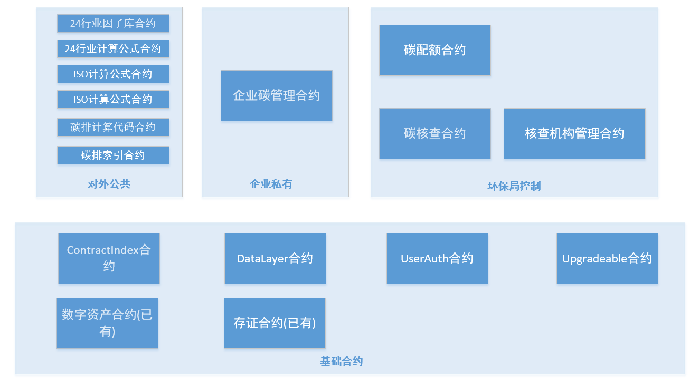
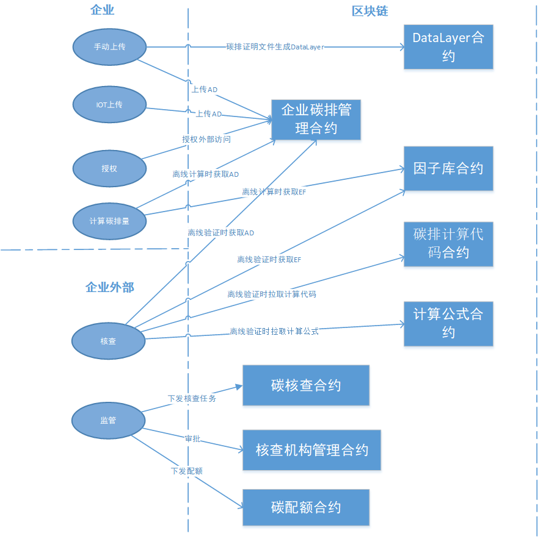

# 合约标准设计

## 一 、合约设计

### 合约概况



> 注：标准范围只涉及以上机构的相关合约。暂时不考虑CCER,碳汇,交易所,碳足迹等。暂时不考虑数据的加密.

### 1 因子库合约

从UserAuth合约继承,可以控制只能由部署者或部署者允许的帐号添加/修改因子,而任何帐号可以查看因子. 因子库可以有多个合约,比如 24行业因子库, ISO因子库等等.

### 2 计算公式合约

从UserAuth合约继承,可以控制只能由部署者或部署者允许的帐号添加/修改公式,任何帐号均可以查看公式.

计算公式合约可以有多个合约,比如 24行业计算公式合约, ISO计算公式合约等等.

计算的具体JS代码保存在计算公式合约中, JS代码需保证是原生代码，没有外部依赖库.

### 3 企业碳管理合约

从UserAuth合约继承,可以控制哪些帐号可以添加/修改/查看碳排数据;可以控制哪些帐号可以生成/修改/查看碳排报告;哪些帐号可以添加/修改/查看企业碳配额;哪些帐号可以添加/修改/查看企业自测因子.

   每个企业对应一个企业碳管理合约. 主要功能有:

   **碳排数据的上传**: 可以通过IOT设备自动上报碳排数据也可以人工上报碳排数据;碳排数据可以选择加密或不加密;每次碳排数据上报时调用Datalayer合约的构造函数生成相应台账,发票等证明文件的DataLayer合约.

   **碳排报告的保存**: 企业离线计算后,生成碳排报告;碳排报告可以选择加密或不加密;.每次碳排报告生成时自动调用 Datalayer合约的构造函数自动生成一个DataLayer合约; 碳排报告的台账,发票等证明文件也需要生成DataLayer合约,在碳排报告的extra字段保存这些证明文件DataLayer的hash,以便于在区块链浏览器上查看验证。

   **碳配额管理**: 年初由环境厅设置配额, 企业年末计算碳排量生成报告进行履约,可以比较实时地监测企业碳配额的变化; 该合约记录企业所属行业,便于计算碳排量生成碳排报告时获取对应行业的因子库和计算公式进行计算.

   企业自测因子库管理:企业自测因子库也放在碳管理合约里,这样既支持核查机构检查,也保证了私密性.

### 4 碳核查合约

从UserAuth合约继承,可以控制只能由部署者或部署者允许的帐号添加/修改/查看碳核查流程;

​    该合约控制每年每个企业的碳核查流程.由环境厅控制.

### 5 碳配额合约

从UserAuth合约继承,可以控制只能由部署者或部署者允许的帐号添加/修改/查看碳配额.

​    该合约年初时由环境厅下发相关企业的配额..由环境厅控制.

### 6 碳系统索引合约

保存有其他合约相关的升级和历史信息. 从这个索引合约可以检索到各个合约的历史记录,版本历史,可以找到对应的合约地址.

### DataLayer 合约

保存企业数据（或则数据摘要），每一个数据需要部署一个DataLayer合约，各个dataLayer之间可以建立关联关系，用于追溯依赖。

**状态**

* 进行中，该状态下可以修改数据，添加依赖
* 已完成
* 取消

**存储位置**

* 少量数据，可以直接存放在链上
* 较大的数据，将数据摘要（MD5 SHA256 等）存放于链上

**依赖**

* 添加DataLayer合约地址来关联其它数据


**所有合约都从Upgradeable合约继承,支持升级.**


## 二 、合约之间的交互




## 三 、碳排计算

​    碳排量上传计算和验证计算过程：计算过程和验证过程均采用离线方式.

### 计算

* 通过企业的后台系统拉取因子库合约中的JSON格式的碳排因子EF,拉取企业碳管理合约中的JSON格式的碳排量AD,
* 通过企业的后台系统拉取计算公式合约中的JSON格式的计算公式FORMULA
* 通过企业的后台系统拉取JS计算代码,
* 在后台系统通过JS代码应用FORMULA,AD,EF,计算出相应的碳排量.再将碳排量上传保存至企业碳管理合约.

### 验证

​	核查机构或环境厅获取企业数据并验证计算记过。

* 从后台系统拉取因子库合约中的JSON格式的碳排因子EF,
* 拉取企业碳管理合约中的JSON格式的碳排量AD,
* 拉取计算公式合约中的JSON格式的计算公式FORMULA和JS计算代码,
* 在后台系统通过JS代码应用FORMULA,AD,EF,计算出相应的碳排量.
* 将**企业填报碳排量**和**计算结果**比对,从而确定是否验证通过.


## 四、因子&公式 数据制定流程

考虑到上传到链上的各个版本因子数据和公式数据的权威性，在流程上增加多方（起草 & 监管 & 企业代表）审核起草的数据。因子数据 和公式合约的数据制定流程保持一致。

### 参与方

* 监管
* 企业代表
* ...

### 状态

* 起草（Draft）
* 检查（Review）
* 生效（Effectuation）

### 流程

> 因子数据 和公式合约的数据制定流程一致, 每一个版本单独审核.

* 起草人员提交数据（比如提交国标 建筑行业的 碳排因子），状态为draft，并指定由哪些accout审核。

- 所有人员可以检查，起草人员有必要就修改，
- 线下所有交流准备妥当后，起草人员设置状态为review
- 所有人员发送transaction 调用合约批准后，自动转为final状态， 任意一方不通过，状态将被设置为draft


注：effectuation状态的 因子| 公式合约 将不能修改数据


## 五、 数据标准

为了规范合约中的数据，我们将会约定合约中的各种命名规范，数据信息保存格式。

由于计算和验证均采用离线方式，企业碳管理合约中保存的碳排数据量AD,因子库合约中保存的因子EF,以及计算公式合约中保存的计算公式FORMULA，均采用约定的JSON格式保存. 合约内部不进行JSON格式的处理.

### 命名

#### 命名规范

碳系统索引合约中：

* 国标因子合约索引命名： `GB_${行业编号}_factor_${YYMMDD}_${预留4个字符}`
* 国标公式合约索引命名： `GB_${行业编号}_falmula_${YYMMDD}_${预留4个字符}`

#### 命名列表

* 国标因子合约索引命名

| 行业名       | 索引名                       |
| ------------ | ---------------------------- |
| 中国发电企业 | `GB_01_factor_20231001_0000` |
| 中国电网企业 | `GB_02_factor_20231001_0000` |
| ...          |                              |

* 国标公式合约索引命名

| 行业名       | 索引名                       |
| ------------ | ---------------------------- |
| 中国发电企业 | `GB_01_factor_20231001_0000` |
| 中国电网企业 | `GB_02_factor_20231001_0000` |
|              |                              |

* ISO因子合约索引命名

...

* ISO公式合约索引命名

...


### 合约1  碳系统索引合约

#### 数据结构

```
contract_num: 2,

mapping(string => address) //对应的合约地址mapping，如：
contracts: {
    "GB_01_factor_20231030_0000": "发电企业factor contract address",
    "GB_02_factor_20231030_0000": "电网企业factor contract address",
}
```


### 合约2  国标24行业因子库

#### 类型

`常量` `一维数据` `二维数据`

* 一维数据： 

```
例：
value_symbol = f(name)
nam： 燃料名
value_symbol： 氧化率、含碳量
```

* 二维数据

```
例：
value_symbol = f( P, T )
P : 压力
T: 温度
value_symbol：热焓
```


#### 数据结构

```
industrycode:"01",

name: "国标因子库-发电企业行业",
version: "v1.0.0",

datalayercontract: "A DataLayer contract address",
```

#### 数据示例

datalayer contract 对应的JSON格式的因子数据为:

```json
{
    //化石燃料燃烧
    "carbon_fuel": {
        type: "od",
        parameter_name: ["name"],
        data:
            [
                [{ value: "gas", unit: "" }, { value: 2513.8, unit: "kJ/kg" }],
            ],
    },
    // 饱和蒸汽热焓
    "carbon_content": {
        type: "sd",
        parameter_name: ["pressure", "temperature"],
        desc: "",
        data:
            [
                [{ value: 0.001, unit: "MPa" }, { value: 6.98, unit: "℃" }, { value: 2513.8, unit: "kJ/kg", range: { min: 0, max: 2 } }],
            ],
    },
}
```


### 合约3  国标24行业计算公式合约

#### 数据结构

```
 industrycode:"01"

 name: "国标计算公式-发电企业行业",
 version: "v1.0.0",

 jscode: "Calculate JS source code",
```

#### 数据示例

datalayer contract 对应的JSON格式的公式数据为:

```
{

"sum":{
    type: "emission_summary",
    formulaid: "01-000",name: "汇总公式",
    formula: "E_fuel + E_e + E_h + E_st + E_proc_e + E_proc -  R",
    factor: "", //关联因子
    calculate_logic: "", // 计算逻辑
},

“E_fuel":{type: "emission_item",

       formulaid: "01-001",

        name: "燃料燃烧产生的CO2排放量",
        formula: "(FC*NCV)* CC*OF*44/12",
        factor: "", //关联因子
        calculate_logic: "", // 计算逻辑
    },

}
```


### 合约4  企业碳管理合约

#### 数据结构

```
name: "xxx企业",
industrycode:"01"

mapping( string => string)  //某个年度的碳配额  如 "2023" =>"12345.543"
mapping( string => uint32) //某个年度已经提交了多少个碳排记录 如 “2023”=>6
mapping( string => (mapping (uint32 => struct))) //具体碳排记录mapping
```


具体碳排记录的mapping如:

```
{
        "2023": {
            // is_bottom 为true 意味着 该数据我们可以 加起来 用于外部系统实时计算年度 碳排
            "01": { data: "A DataLayer contract address", invalid: false, title: "一月" , is_bottom: true, result: "120.3"},
            "02": { data: "A DataLayer contract address", invalid: false, title: "二月" , is_bottom: true, result: "120.31"},
            "03": { data: "A DataLayer contract address", invalid: false, title: "三月" , is_bottom: true, result: "120.378"},
            "04": { data: "A DataLayer contract address", invalid: false, title: "一季度" , is_bottom: false, result: "380.3"},
            "05": { data: "A DataLayer contract address", invalid: false, title: "四月" , is_bottom: true, result: "120.345"},
            "05": { data: "A DataLayer contract address", invalid: false, title: "年度报告" , is_bottom: false, result: "678.543"},
        }
}
```


#### 数据示例

datalayer contract 对应的JSON格式的碳排数据为:

```
{
    "records": [
        // 用户自填因子
        { "FC": 1, "NCV": 1, "CC": 1, "OF": 100, "fule": "天然气" },

        // 使用默认因子，当然如果fule在因子表中不存在，就应该报错
        { "FC": 1, "fule": "天然气" },

    ],

    "title": "四月",

    "total": "11023.345",

    "extrainfo": [

        "文件"[
        [{ "name": "2023年4月燃煤进厂台账文件" },
        { "datalayerhash": "0x12345678901234567890123456789012" }],

        [{ "name": "2023年4月购电发票" },
        { "datalayerhash": "0x12345678901234567890123456789013" }]

        ///......

        ]
}
```

