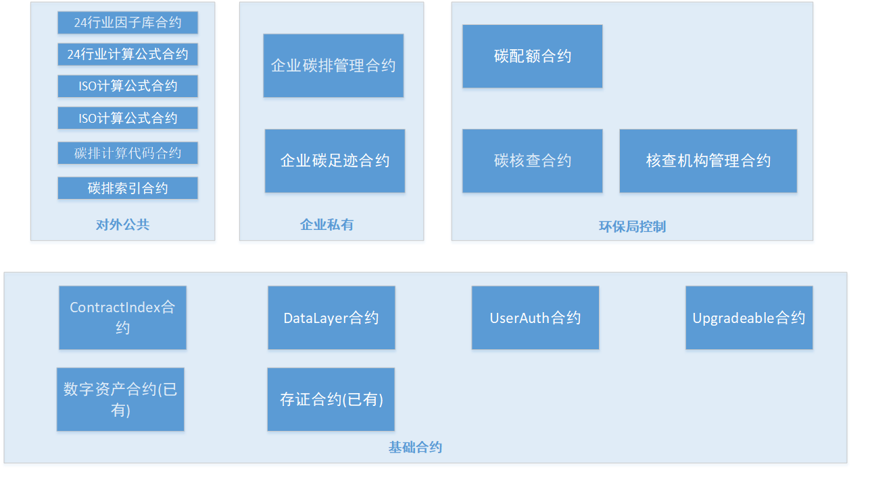

# 合约标准设计

一 合约设计

标准范围只涉及以上机构的相关合约。暂时不考虑CCER,碳汇,交易所,碳足迹等。暂时不考虑数据的加密.

1 因子库合约从UserAuth合约继承,可以控制只能由部署者或部署者允许的帐号添加/修改因子,而任何帐号可以查看因子.

​    因子库可以有多个合约,比如 24行业因子库, ISO因子库等等. 

2 计算公式合约从UserAuth合约继承,可以控制只能由部署者或部署者允许的帐号添加/修改公式,任何帐号均可以查看公式.

​    计算公式合约可以有多个合约,比如 24行业计算公式合约, ISO计算公式合约等等. 

​	计算的具体JS代码保存在计算公式合约中, JS代码需保证是原生代码，没有外部依赖库.

3 企业碳管理合约从UserAuth合约继承,可以控制哪些帐号可以添加/修改/查看碳排数据;可以控制哪些帐号可以生成/修改/查看碳排报告;哪些帐号可以添加/修改/查看企业碳配额;哪些帐号可以添加/修改/查看企业自测因子.

   每个企业对应一个企业碳管理合约. 主要功能有:

   碳排数据的上传: 可以通过IOT设备自动上报碳排数据也可以人工上报碳排数据;碳排数据可以选择加密或不加密;每次碳排数据上报时调用Datalayer合约的构造函数生成相应台账,发票等证明文件的DataLayer合约.

   碳排报告的保存: 企业离线计算后,生成碳排报告;碳排报告可以选择加密或不加密;.每次碳排报告生成时自动调用 Datalayer合约的构造函数自动生成一个DataLayer合约; 碳排报告的台账,发票等证明文件也需要生成DataLayer合约,在碳排报告的extra字段保存这些证明文件DataLayer的hash,以便于在区块链浏览器上查看验证。

   碳配额管理: 年初由环境厅设置配额, 企业年末计算碳排量生成报告进行履约,可以比较实时地监测企业碳配额的变化; 该合约记录企业所属行业,便于计算碳排量生成碳排报告时获取对应行业的因子库和计算公式进行计算.

   企业自测因子库管理:企业自测因子库也放在碳管理合约里,这样既支持核查机构检查,也保证了私密性.

4 碳核查合约从UserAuth合约继承,可以控制只能由部署者或部署者允许的帐号添加/修改/查看碳核查流程;

​    该合约控制每年每个企业的碳核查流程.由环境厅控制.

5 碳配额合约从UserAuth合约继承,可以控制只能由部署者或部署者允许的帐号添加/修改/查看碳配额.

​    该合约年初时由环境厅下发相关企业的配额..由环境厅控制.

6 碳系统索引合约保存有其他合约相关的升级和历史信息. 从这个索引合约可以检索到各个合约的历史记录,版本历史,可以找到对应的合约地址.

7 所有合约都从Upgradeable合约继承,支持升级.

二 合约之间的交互

三 计算

​    碳排量上传计算和验证计算过程：计算过程和验证过程均采用离线方式.

​             企业计算时: 企业的后台系统拉取因子库合约中的JSON格式的碳排因子EF,拉取企业碳管理合约中的JSON格式的碳排量AD,拉取计算公式合约中的JSON格式的计算公式FORMULA和JS计算代码, 在后台系统通过JS代码应用FORMULA,AD,EF,计算出相应的碳排量.再将碳排量上传保存至企业碳管理合约.

​             核查机构或环境厅验证计算时:核查机构或环境厅的后台系统拉取因子库合约中的JSON格式的碳排因子EF,拉取企业碳管理合约中的JSON格式的碳排量AD,拉取计算公式合约中的JSON格式的计算公式FORMULA和JS计算代码, 在后台系统通过JS代码应用FORMULA,AD,EF,计算出相应的碳排量.再将碳排量和保存在企业碳管理合约中的企业计算出的碳排量进行比对,从而确定是否验证通过.

四 格式

​     因为计算和验证均采用离线方式，企业碳管理合约中保存的碳排数据量AD,因子库合约中保存的因子EF,以及计算公式合约中保存的计算公式FORMULA，以及最后的碳排报告,均采用约定的JSON格式保存. 合约内部不进行JSON格式的处理.

​    (1)24行业因子库JSON格式:

============================================
{
  "FactorCode": "01-001",
  "Name": "发电企业-化石燃料燃烧",

  "燃煤": [
    {"CC":0.02858},
    {"NCV":26.7},
    {"OF":0.98}
  ],

  "原油": [
    {"CC":0.02008},
    {"NCV":41.816},
    {"OF":0.98}
  ],

  "焦炉煤气": [
    {"CC":0.01358},
    {"NCV":12.726},
    {"OF":0.99}
  ]
  ......

}

============================================

{
  "FactorCode": "01-002",
  "Name": "发电企业-外购电力",

  "电力排放因子": [
    {"EF":0.581}
  ]

}

============================================

{
  "FactorCode": "01-003",
  "Name": "发电企业-工业生产过程(脱硫过程)",

  "CaCO3": [
    {"I":0.9},
    {"TR":1},
    {"EF":0.44}
  ],

  "MaCO3": [
    {"I":0.9},
    {"TR":1},
    {"EF":0.552}
  ],

  "Na2CO3": [
    {"I":0.9},
    {"TR":1},
    {"EF":0.415}
  ]
  ......

}

============================================

{
  "FactorCode": "19-004",
  "Name": "矿山企业-净购入的蒸汽",

  "饱和蒸汽": [
    [{"T":369.79},
    {"P":21},
    {"En":2340.2},
    {"EF":0.11}],

   [{"T":373.68},
    {"P":22},
    {"En":2192.5},
    {"EF":0.11}]

​    ......

  ],

  "过热蒸汽": [
    [{"T":0},
    {"P":0.1},
    {"En":0.1},
    {"EF":0.11}],

   [{"T":10},
    {"P":10},
    {"En":51.7},
    {"EF":0.11}]
     ......

  ]

}

 (2)24行业计算公式JSON格式:

{

  "FormulaCode": "01-001",
  "Name": "发电企业-化石燃料燃烧",
  "Formula": "E=[(FC * NCV)*(CC * OF * 44/12)]"

}

============================================

{
  "FormulaCode": "01-002",
  "Name": "发电企业-外购电力",
  "Formula": "E=AC*EF"

}

============================================

{
  "FormulaCode": "01-003",
  "Name": "发电企业-工业生产过程(脱硫过程)",
  "Formula": "E=B*I*EF*TR"

}

============================================

{
  "FormulaCode": "19-004",
  "Name": "矿山企业-净购入的蒸汽",
  "Formula": "E=[Ma * (En-83.74)/1000]*EF"

}

 (3)上传碳排数据JSON格式:

============================================
{
  "FactorCode": "01-001",
  "FormulaCode": "01-001",
  "Name": "发电企业-化石燃料燃烧",

  "燃煤消耗量": [
    {"FC":0.02}
  ],

  "原油消耗量": [
    {"FC":0.03}
  ],

  "焦炉煤气消耗量": [
    {"FC":0.04}
  ]
  ......

}

============================================

{
  "FactorCode": "01-002",
  "FormulaCode": "01-002",
  "Name": "发电企业-外购电力",

  "外购电力消耗量": [
    {"AC":0.5}
  ]

}

============================================

{
  "FactorCode": "01-003",
  "FormulaCode": "01-003",
  "Name": "发电企业-工业生产过程(脱硫过程)",

  "CaCO3消耗量": [
    {"B":0.9}
  ],

  "MaCO3消耗量": [
    {"B":0.8}
  ],

  "Na2CO3消耗量": [
    {"B":0.7}
  ]
  ......

}

============================================

{
  "FactorCode": "19-004",
  "FormulaCode": "19-004",
  "Name": "矿山企业-净购入的蒸汽",

  "饱和蒸汽质量": [
    [{"T":369.79},
    {"P":21},
    {"Ma":23}],

​    [{"T":373.68},
​     {"P":22},
​     {"Ma":21}]
​       ......

​      ],

  "过热蒸汽": [
    [{"T":0},
    {"P":0.1},
    {"Ma":12.5}],

​    [{"T":10},
​     {"P":10},
​     {"Ma":5.7}]
​      ......

 ]

}

 (4)碳排报告JSON格式:

============================================

{
  "FactorCode": "01-001",
  "FormulaCode": "01-001",
  "Name": "发电企业-化石燃料燃烧",
  "result": "1023.345",

  "燃煤": [
    {"FC":0.02},
    {"CC":0.02858},
    {"NCV":26.7},
    {"OF":0.98}
  ],

  "原油": [
    {"FC":0.03},
    {"CC":0.02008},
    {"NCV":41.816},
    {"OF":0.98}
  ],

  "焦炉煤气": [
    {"FC":0.04},
    {"CC":0.01358},
    {"NCV":12.726},
    {"OF":0.99}
  ]
  ......

}

============================================

{
  "FactorCode": "01-002",
  "FormulaCode": "01-002",
  "Name": "发电企业-外购电力",
  "result": "23.3",

  "电力排放因子": [
    {"AC":0.5},
    {"EF":0.581}
  ]

}

============================================

{
  "FactorCode": "01-003",
  "FormulaCode": "01-003",
  "Name": "发电企业-工业生产过程(脱硫过程)",
  "result": "98.123",

  "CaCO3": [
    {"B":0.9},
    {"I":0.9},
    {"TR":1},
    {"EF":0.44}
  ],

  "MaCO3": [
    {"B":0.8},
    {"I":0.9},
    {"TR":1},
    {"EF":0.552}
  ],

  "Na2CO3": [
    {"B":0.7},
    {"I":0.9},
    {"TR":1},
    {"EF":0.415}
  ]
  ......

}

============================================

{
  "FactorCode": "19-004",
  "FormulaCode": "19-004",
  "Name": "矿山企业-净购入的蒸汽",
  "result": "1314.888",

  "饱和蒸汽": [
    [{"Ma":23},
    {"T":369.79},
    {"P":21},
    {"En":2340.2},
    {"EF":0.11}],

​    [{"Ma":21},
​     {"T":373.68},
​     {"P":22},
​     {"En":2192.5},
​     {"EF":0.11}]
......

  ],

  "过热蒸汽": [
    [{"Ma":12.5},
    {"T":0},
    {"P":0.1},
    {"En":0.1},
    {"EF":0.11}],

​    [{"Ma":5.7},
​     {"T":10},
​     {"P":10},
​     {"En":51.7},
​     {"EF":0.11}]
​    ......

 ]

============================================

汇总:

"total": "11023.345",

"extrainfo" [

"文件" [
    [{"name":“2023年5月燃煤进厂台账文件”},
    {"datalayerhash":"0x12345678901234567890123456789012"}], 

   [{"name":“2023年5月购电发票”},
    {"datalayerhash":"0x12345678901234567890123456789013"}]

​    ......

]

